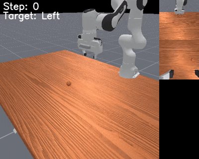
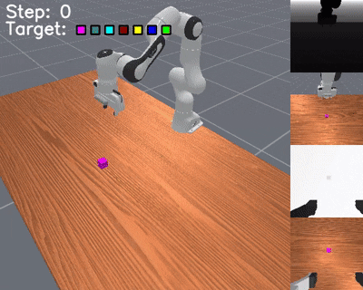
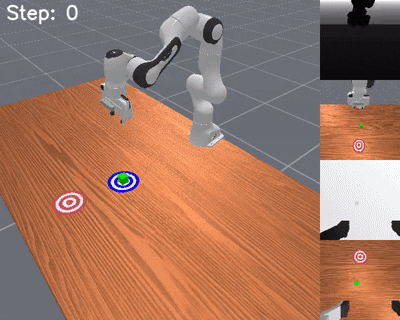
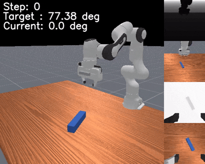
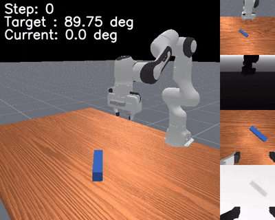
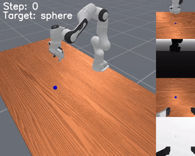
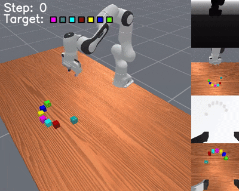

<h1 align="center">MIKASA-Robo</h1>

<h3 align="center">Benchmark for robotic tabletop manipulation memory-intensive tasks</h3>

<div align="center">
    <a href="https://arxiv.org/abs/2502.10550">
        
    </a>
    <a href="https://sites.google.com/view/memorybenchrobots/">
        
    </a>
    <a href="https://pypi.org/project/mikasa-robo-suite/">
        
    </a>
    <a href="https://github.com/CognitiveAISystems/MIKASA-Robo">
        
    </a>
    <a href="https://huggingface.co/datasets/avanturist/mikasa-robo">
        
    </a>
</div>

---

<div align="center" style="display: flex; justify-content: center; gap: 10px;">
    
    
    
    
</div>
<p align="center"><i>Example tasks from the MIKASA-Robo benchmark</i></p>

<p align="center">
    <b>🎉 NOW AVAILABLE ON PIP! 🎉</b><br>
    <code>pip install mikasa-robo-suite</code>
</p>

<p align="center">
    <b>🎯 ALL 32 DATASETS NOW AVAILABLE!🎯</b><br>
    <i>Check out our <a href="#datasets-for-offline-rl">memory-intensive training datasets</a> for Offline RL!</i>
</p>


## Table of Contents
- [Overview](#overview)
- [Key Features](#key-features)
- [List of Tasks](#list-of-tasks)
- [Quick Start](#quick-start)
  - [Installation](#installation)
  - [Basic Usage](#basic-usage)
  - [Advanced Usage: Debug Wrappers](#advanced-usage-debug-wrappers)
- [Training](#training)
- [MIKASA-Robo Ideology](#mikasa-robo-ideology)
- [Datasets for Offline RL](#datasets-for-offline-rl)
  - [Download ready-made datasets](#download-ready-made-datasets)
  - [Collect datasets using oracle agents checkpoints](#collect-datasets-using-oracle-agents-checkpoints)
- [Citation](#citation)

## Overview

MIKASA-Robo is a comprehensive benchmark suite for memory-intensive robotic manipulation tasks, part of the MIKASA (Memory-Intensive Skills Assessment Suite for Agents) framework. It features:

- 12 distinct task types with varying difficulty levels
- 32 total tasks covering different memory aspects
- 32 visual-based datasets for Offline RL
- First benchmark specifically designed for testing agent memory in robotic manipulation

## Key Features

- **Diverse Memory Testing**: Covers four fundamental memory types:
  - Object Memory
  - Spatial Memory
  - Sequential Memory
  - Memory Capacity

- **Built on ManiSkill3**: Leverages the powerful [ManiSkill3](https://maniskill.readthedocs.io/en/latest/) framework, providing:
  - GPU parallelization
  - User-friendly interface
  - Customizable environments


## List of Tasks

| Preview | Memory Task | Mode | Brief Description | T | Memory Task Type |
|--------------------------|------------|------|------|---|--|
|  | `ShellGame[Mode]-v0` | `Touch`<br>`Push`<br>`Pick` | Memorize the position of the ball after some time being covered by the cups and then interact with the cup the ball is under. | 90 | Object |
|  | `Intercept[Mode]-v0` | `Slow`<br>`Medium`<br>`Fast` | Memorize the positions of the rolling ball, estimate its velocity through those positions, and then aim the ball at the target. | 90| Spatial |
|  | `InterceptGrab[Mode]-v0` | `Slow`<br>`Medium`<br>`Fast` | Memorize the positions of the rolling ball, estimate its velocity through those positions, and then catch the ball with the gripper and lift it up. | 90 | Spatial |
|  | `RotateLenient[Mode]-v0` | `Pos`<br>`PosNeg` | Memorize the initial position of the peg and rotate it by a given angle. | 90| Spatial |
|  | `RotateStrict[Mode]-v0` | `Pos`<br>`PosNeg` | Memorize the initial position of the peg and rotate it to a given angle without shifting its center. | 90 | Object |
|  | `TakeItBack-v0` | --- | Memorize the initial position of the cube, move it to the target region, and then return it to its initial position. | 180 | Spatial |
|  | `RememberColor[Mode]-v0` | `3`/`5`/`9` | Memorize the color of the cube and choose among other colors. | 60 | Object |
|  | `RememberShape[Mode]-v0` | `3`/`5`/`9` | Memorize the shape of the cube and choose among other shapes. | 60 | Object |
|  | `RememberShapeAndColor[Mode]-v0` | `3×2`/`3×3`<br>`5×3` | Memorize the shape and color of the cube and choose among other shapes and colors. | 60 | Object |
|  | `BunchOfColors[Mode]-v0` | `3`/`5`/`7` | Remember the colors of the set of cubes shown simultaneously in the bunch and touch them in any order. | 120 | Capacity |
|  | `SeqOfColors[Mode]-v0` | `3`/`5`/`7` | Remember the colors of the set of cubes shown sequentially and then select them in any order. | 120 | Capacity |
|  | `ChainOfColors[Mode]-v0` | `3`/`5`/`7` | Remember the colors of the set of cubes shown sequentially and then select them in the same order. | 120 | Sequential |

**Total: 32 tabletop robotic manipulation memory-intensive tasks in 12 groups**. T - episode timeout.


## Quick Start

### Installation
```bash
# Local installation
git clone git@github.com:CognitiveAISystems/MIKASA-Robo.git
cd MIKASA-Robo
pip install -e .

# Remote installation
pip install mikasa-robo-suite
```


## Basic Usage
```python
import mikasa_robo_suite
from mikasa_robo_suite.utils.wrappers import StateOnlyTensorToDictWrapper
from tqdm.notebook import tqdm
import torch
import gymnasium as gym

# Create the environment via gym.make()
# obs_mode="rgb" for modes "RGB", "RGB+joint", "RGB+oracle" etc.
# obs_mode="state" for mode "state"
episode_timeout = 90
env = gym.make("RememberColor9-v0", num_envs=4, obs_mode="rgb", render_mode="all")
env = StateOnlyTensorToDictWrapper(env) # * always use this wrapper!

obs, _ = env.reset(seed=42)
print(obs.keys())
for i in tqdm(range(episode_timeout)):
    action = env.action_space.sample()
    obs, reward, terminated, truncated, info = env.step(torch.from_numpy(action))

env.close()
```

## Advanced Usage: Debug Wrappers
MIKASA-Robo has implemented special task-specific and task-agnostic wrappers that allow you to track the progress of agents training, the reward agents receive, the number of steps agents have taken, and the individual contribution from each reward component. It is not necessary to use these wrappers, but if you do decide not to use them, remember that `env = StateOnlyTensorToDictWrapper(env)` **must always be used** to get the correct observation keys! For mode details see [quick_start.ipynb](https://github.com/CognitiveAISystems/MIKASA-Robo/blob/main/quick_start.ipynb).

### With all task-predefined wrappers
```python
import mikasa_robo_suite
from mikasa_robo_suite.dataset_collectors.get_mikasa_robo_datasets import env_info
from tqdm.notebook import tqdm
import torch
import gymnasium as gym

env_name = "RememberColor9-v0"
obs_mode = "rgb" # or "state"
num_envs = 4
seed = 42

env = gym.make(env_name, num_envs=num_envs, obs_mode=obs_mode, render_mode="all")

state_wrappers_list, episode_timeout = env_info(env_name)
print(f"Episode timeout: {episode_timeout}")
for wrapper_class, wrapper_kwargs in state_wrappers_list:
    env = wrapper_class(env, **wrapper_kwargs)

obs, _ = env.reset(seed=seed)
print(obs.keys())
for i in tqdm(range(episode_timeout)):
    action = env.action_space.sample()
    obs, reward, terminated, truncated, info = env.step(torch.from_numpy(action))

env.close()
```
### With selective wrappers
```python
import mikasa_robo_suite
from mikasa_robo_suite.utils.wrappers import *
from mikasa_robo_suite.memory_envs import *
import gymnasium as gym
from gymnasium.envs.registration import registry
from tqdm.notebook import tqdm

env_name = "ShellGameTouch-v0"
obs_mode = "state"
num_envs = 4
seed = 42

env = gym.make(env_name, num_envs=num_envs, obs_mode=obs_mode, render_mode="all")
max_steps = registry.get(env_name).max_episode_steps
print(f"Episode timeout: {max_steps}")

env = StateOnlyTensorToDictWrapper(env)
env = InitialZeroActionWrapper(env, n_initial_steps=1)
env = ShellGameRenderCupInfoWrapper(env)
env = RenderStepInfoWrapper(env)
env = RenderRewardInfoWrapper(env)
env = DebugRewardWrapper(env)

obs, _ = env.reset(seed=seed)
print(obs.keys())
for i in tqdm(range(max_steps)):
    action = env.action_space.sample()
    obs, reward, terminated, truncated, info = env.step(torch.from_numpy(action))

env.close()
```

## Training
MIKASA-Robo supports multiple training configurations:

### PPO with MLP (State-Based)
```bash
python3 baselines/ppo/ppo_memtasks.py \
    --env_id=RememberColor9-v0 \
    --exp-name=remember-color-9-v0 \
    --num-steps=60 \
    --num_eval_steps=180 \
    --include-state
```

### PPO with MLP (RGB + Joint)
```bash
python3 baselines/ppo/ppo_memtasks.py \
    --env_id=RememberColor9-v0 \
    --exp-name=remember-color-9-v0 \
    --num-steps=60 \
    --num_eval_steps=180 \
    --include-rgb \
    --include-joints
```

### PPO with LSTM (RGB + Joint)
```bash
python3 baselines/ppo/ppo_memtasks_lstm.py \
    --env_id=RememberColor9-v0 \
    --exp-name=remember-color-9-v0 \
    --num-steps=60 \
    --num_eval_steps=180 \
    --include-rgb \
    --include-joints
```

To train with sparse rewards, add `--reward-mode=sparse`.

## MIKASA-Robo Ideology
The agent's memory capabilities can be accessed not only when the environment demands memory, but also when the observations are provided in the correct format. Currently, we have implemented several training modes:

- `state`: In this mode, the agent receives comprehensive, vectorized information about the environment, joints, and TCP pose, along with oracle data that is essential for solving memory-intensive tasks. When trained in this way, the agent addresses the MDP problem and **does not require memory**.

- `RGB+joints`: Here, the agent receives image data from a camera mounted above and from the manipulator's gripper, along with the position and velocity of its joints. This mode provides no additional information, meaning the agent must learn to store and utilize oracle data. It is designed to **test the agent's memory** capabilities.

These training modes are obtained by using correct flags. Thus,
```bash
# To train in `state` mode:
--include-state

# To train in `RGB+joints` mode:
--include-rgb \
--include-joints

# Additionally, for debugging you can add oracle information to the observation:
--include-oracle
```

## Datasets for Offline RL
For Offline RL we have prepared several ready-made datasets available for use immediately after download, as well as checkpoints of trained oracle agents to collect datasets of any size for all MIKASA-Robo tasks using single script.

### Download ready-made datasets
To allow you to quickly start offline training, we provide datasets for all 32 MIKASA-Robo tasks, consisting of 1000 episodes each and available on [Hugging Face](https://huggingface.co/datasets/avanturist/mikasa-robo/tree/main) (~200G in total):

1. [Download `ShellGameTouch-v0` dataset](https://huggingface.co/datasets/avanturist/mikasa-robo/resolve/main/ShellGameTouch-v0.zip)
2. [Download `ShellGamePush-v0` dataset](https://huggingface.co/datasets/avanturist/mikasa-robo/resolve/main/ShellGamePush-v0.zip)
3. [Download `ShellGamePick-v0` dataset](https://huggingface.co/datasets/avanturist/mikasa-robo/resolve/main/ShellGamePick-v0.zip)
4. [Download `InterceptSlow-v0` dataset](https://huggingface.co/datasets/avanturist/mikasa-robo/resolve/main/InterceptSlow-v0.zip)
5. [Download `InterceptMedium-v0` dataset](https://huggingface.co/datasets/avanturist/mikasa-robo/resolve/main/InterceptMedium-v0.zip)
6. [Download `InterceptFast-v0` dataset](https://huggingface.co/datasets/avanturist/mikasa-robo/resolve/main/InterceptFast-v0.zip)
7. [Download `InterceptGrabSlow-v0` dataset](https://huggingface.co/datasets/avanturist/mikasa-robo/resolve/main/InterceptGrabSlow-v0.zip)
8. [Download `InterceptGrabMedium-v0` dataset](https://huggingface.co/datasets/avanturist/mikasa-robo/resolve/main/InterceptGrabMedium-v0.zip)
9. [Download `InterceptGrabFast-v0` dataset](https://huggingface.co/datasets/avanturist/mikasa-robo/resolve/main/InterceptGrabFast-v0.zip)
10. [Download `RotateLenientPos-v0` dataset](https://huggingface.co/datasets/avanturist/mikasa-robo/resolve/main/RotateLenientPos-v0.zip)
11. [Download `RotateLenientPosNeg-v0` dataset](https://huggingface.co/datasets/avanturist/mikasa-robo/resolve/main/RotateLenientPosNeg-v0.zip)
12. [Download `RotateStrictPos-v0` dataset](https://huggingface.co/datasets/avanturist/mikasa-robo/resolve/main/RotateStrictPos-v0.zip)
13. [Download `RotateStrictPosNeg-v0` dataset](https://huggingface.co/datasets/avanturist/mikasa-robo/resolve/main/RotateStrictPosNeg-v0.zip)
14. [Download `TakeItBack-v0` dataset](https://huggingface.co/datasets/avanturist/mikasa-robo/resolve/main/TakeItBack-v0.zip)
15. [Download `RememberColor3-v0` dataset](https://huggingface.co/datasets/avanturist/mikasa-robo/resolve/main/RememberColor3-v0.zip)
16. [Download `RememberColor5-v0` dataset](https://huggingface.co/datasets/avanturist/mikasa-robo/resolve/main/RememberColor5-v0.zip)
17. [Download `RememberColor9-v0` dataset](https://huggingface.co/datasets/avanturist/mikasa-robo/resolve/main/RememberColor9-v0.zip)
18. [Download `RememberShape3-v0` dataset](https://huggingface.co/datasets/avanturist/mikasa-robo/resolve/main/RememberShape3-v0.zip)
19. [Download `RememberShape5-v0` dataset](https://huggingface.co/datasets/avanturist/mikasa-robo/resolve/main/RememberShape5-v0.zip)
20. [Download `RememberShape9-v0` dataset](https://huggingface.co/datasets/avanturist/mikasa-robo/resolve/main/RememberShape9-v0.zip)
21. [Download `RememberShapeAndColor3x2-v0` dataset](https://huggingface.co/datasets/avanturist/mikasa-robo/resolve/main/RememberShapeAndColor3x2-v0.zip)
22. [Download `RememberShapeAndColor3x3-v0` dataset](https://huggingface.co/datasets/avanturist/mikasa-robo/resolve/main/RememberShapeAndColor3x3-v0.zip)
23. [Download `RememberShapeAndColor5x3-v0` dataset](https://huggingface.co/datasets/avanturist/mikasa-robo/resolve/main/RememberShapeAndColor5x3-v0.zip)
24. [Download `BunchOfColors3-v0` dataset](https://huggingface.co/datasets/avanturist/mikasa-robo/resolve/main/BunchOfColors3-v0.zip)
25. [Download `BunchOfColors5-v0` dataset](https://huggingface.co/datasets/avanturist/mikasa-robo/resolve/main/BunchOfColors5-v0.zip)
26. [Download `BunchOfColors7-v0` dataset](https://huggingface.co/datasets/avanturist/mikasa-robo/resolve/main/BunchOfColors7-v0.zip)
27. [Download `SeqOfColors3-v0` dataset](https://huggingface.co/datasets/avanturist/mikasa-robo/resolve/main/SeqOfColors3-v0.zip)
28. [Download `SeqOfColors5-v0` dataset](https://huggingface.co/datasets/avanturist/mikasa-robo/resolve/main/SeqOfColors5-v0.zip)
29. [Download `SeqOfColors7-v0` dataset](https://huggingface.co/datasets/avanturist/mikasa-robo/resolve/main/SeqOfColors7-v0.zip)
30. [Download `ChainOfColors3-v0` dataset](https://huggingface.co/datasets/avanturist/mikasa-robo/resolve/main/ChainOfColors3-v0.zip)
31. [Download `ChainOfColors5-v0` dataset](https://huggingface.co/datasets/avanturist/mikasa-robo/resolve/main/ChainOfColors5-v0.zip)
32. [Download `ChainOfColors7-v0` dataset](https://huggingface.co/datasets/avanturist/mikasa-robo/resolve/main/ChainOfColors7-v0.zip)

Example of the dataset structure for `ShellGameTouch-v0` with episode timeout T = 90:
```python
import numpy as mp
episode = np.load(f'ShellGameTouch-v0/train_data_781.npz')

print(episode['rgb'].shape) # (90, 128, 128, 6) - two RGB images (view from above and from the gripper)
print(episode['joints'].shape) # (90, 25) - joint positions and velocities, and Tool Center Point (TCP) position and rotation
print(episode['action'].shape) # (90, 8) - action (8-dimensional vector)
print(episode['reward'].shape) # (90, ) - (dense) reward for each step
print(episode['success'].shape) # (90,) - (sparse) success flag for each step
print(episode['done'].shape) # (90, ) - done flag for each step
```

### Collect datasets using oracle agents checkpoints
Download checkpoints (160Mb) of pretrained oracle agents for further datasets collection:
```bash
cd MIKASA-Robo

wget https://huggingface.co/datasets/avanturist/mikasa-robo/resolve/main/oracle_checkpoints.zip

unzip oracle_checkpoints.zip
```

Or, if you want to train oracle agents from scratch, use this code:
```bash
# For single task:
python3 mikasa_robo_suite/dataset_collectors/get_dataset_collectors_ckpt.py --env_id=ShellGameTouch-v0

# For all tasks:
python3 mikasa_robo_suite/dataset_collectors/parallel_training_manager.py
```

Once you download / trained oracle agents checkpoints, you can build datasets of arbitrary size (multiples of 250 episodes) for any MIKASA-Robo task:
```bash
# For single task:
python3 mikasa_robo_suite/dataset_collectors/get_mikasa_robo_datasets.py \
    --env-id=ShellGameTouch-v0 \
    --path-to-save-data="data" \
    --ckpt-dir="." \
    --num-train-data=1000

# For all tasks:
python3 mikasa_robo_suite/dataset_collectors/parallel_dataset_collection_manager.py \
    --path-to-save-data="data" \
    --ckpt-dir="." \
    --num-train-data=1000
```

## Citation
If you find our work useful, please cite our paper:
```
@misc{cherepanov2025mikasa,
      title={Memory, Benchmark & Robots: A Benchmark for Solving Complex Tasks with Reinforcement Learning}, 
      author={Egor Cherepanov and Nikita Kachaev and Alexey K. Kovalev and Aleksandr I. Panov},
      year={2025},
      eprint={2502.10550},
      archivePrefix={arXiv},
      primaryClass={cs.LG},
      url={https://arxiv.org/abs/2502.10550}, 
}
```